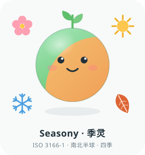
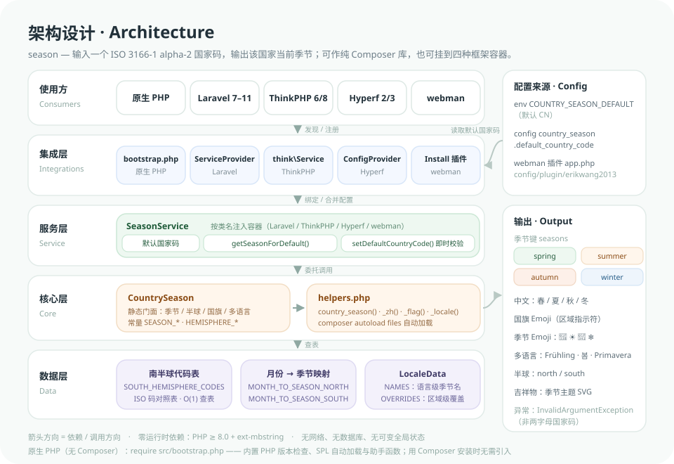
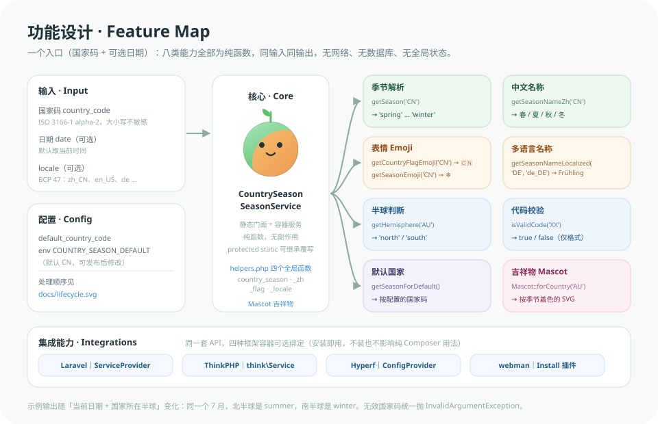
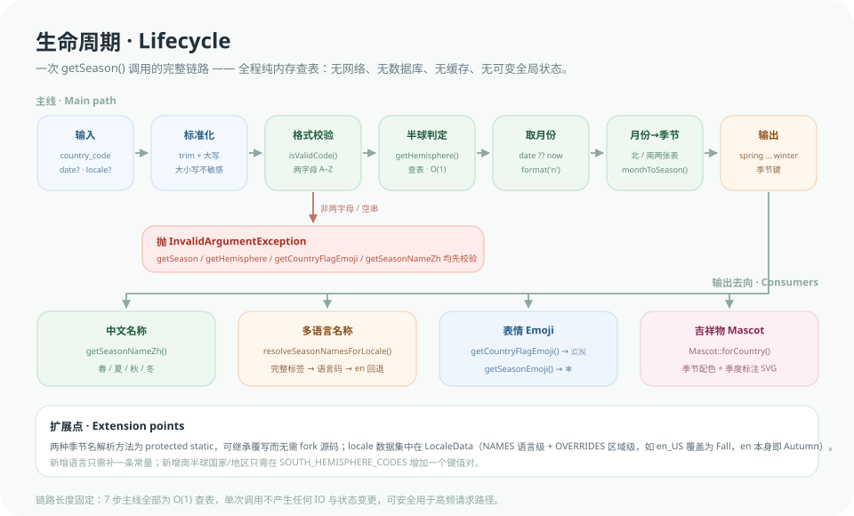

# season

**Language:** [English](README.md) · [简体中文](README.zh-CN.md)

<p align="center"></p>

**Seasony** is the project mascot: a little globe whose left half is spring and right half is autumn — exactly what this library does, since the same month is a different season in each hemisphere. It ships as an API too (`Mascot::forCountry()`, see below), recolored and captioned for any country’s current season.

PHP library / extension that resolves the current **season** from an **ISO 3166-1 alpha-2** country code. Use it as a plain Composer package, or integrate with **Laravel 7–11**, **ThinkPHP 6 / 8**, **Hyperf 2 / 3**, and **webman**. Besides English season keys (`spring`, etc.) and Chinese names, it provides **flag emoji**, **localized season names** by **BCP 47** locale, hemisphere detection, and optional date-based calculation.

- **Northern hemisphere:** spring Mar–May, summer Jun–Aug, autumn Sep–Nov, winter Dec / Jan / Feb  
- **Southern hemisphere:** autumn Mar–May, winter Jun–Aug, spring Sep–Nov, summer Dec / Jan / Feb  

## Project structure

```text
season/
├── src/
│   ├── CountrySeason.php      Core: season / hemisphere / flag emoji / localized names (static API)
│   ├── SeasonService.php      Container-friendly service: default country code + core API
│   ├── LocaleData.php         Built-in localized season names (NAMES + OVERRIDES)
│   ├── Mascot.php             Seasony mascot: SVG output, themed by season
│   ├── helpers.php            6 global helpers (season / Chinese / flag / emoji / locale / mascot)
│   ├── bootstrap.php          Native PHP (no Composer) bootstrap: version check + SPL autoload + helpers
│   ├── Install.php            webman plugin install / uninstall
│   ├── Laravel/               CountrySeasonServiceProvider (auto-discovery, publishable config)
│   ├── ThinkPHP/              Service (discovered by the think extension mechanism)
│   ├── Hyperf/                ConfigProvider (container binding, publishable config)
│   └── config/plugin/erikwang2013/season/app.php   webman plugin defaults
├── config/country_season.php  default_country_code (shared by Laravel / ThinkPHP / Hyperf)
├── docs/                      Mascot and diagrams (mascot / architecture / function / lifecycle .svg)
├── tests/                     PHPUnit suite (framework stubs under tests/Stubs)
└── composer.json              PSR-4 + files autoload, Laravel / ThinkPHP / Hyperf declarations
```

## Architecture



Five layers, top to bottom — consumers (plain PHP / Laravel / ThinkPHP / Hyperf / webman) → integrations (framework service providers plus the webman installer) → service layer (`SeasonService` holding the default country code) → core (`CountrySeason` and `helpers.php`) → data (southern-hemisphere table, month-to-season maps, `LocaleData`). Config sources and outputs sit in the right column.

## Feature map



One entry point (country code + optional date), eight pure-function capabilities: season key, Chinese name, flag emoji, localized name, hemisphere, code validation, configured default, and the season-themed mascot.

## Lifecycle



The seven-step main path of a single `getSeason()` call: input → normalize → two-letter validation (throws `InvalidArgumentException` on failure) → hemisphere lookup (O(1)) → month → month-to-season map → season key, then optionally rendered as Chinese / localized / flag emoji / mascot. Pure in-memory lookups; no IO, no state changes.

## Installation

```bash
composer require erikwang2013/season
```

## Native PHP (no Composer, no framework)

Drop the `src/` directory anywhere in your project (plus `docs/mascot.svg` if you want `country_season_mascot()`) and require the bootstrap file — no Composer, no framework:

```php
require '/path/to/season/src/bootstrap.php';   // version check + SPL autoload + global helpers

echo country_season('CN');        // spring | summer | autumn | winter
echo country_season_zh('AU');     // 春 | 夏 | 秋 | 冬
echo country_season_flag('JP');   // 🇯🇵
echo country_season_emoji('US');  // 🌸 | ☀️ | 🍁 | ❄️
echo country_season_mascot('DE'); // mascot SVG themed for Germany's current season

// classes work too (PSR-4 style autoloading)
new \Erikwang2013\Season\SeasonService('CN');
```

- `bootstrap.php` does three things: check the PHP version (a clear error instead of a syntax error below 8.0), register an `Erikwang2013\Season\*` SPL autoloader, and load `helpers.php`.
- **Requiring it twice is safe** — autoloaders can be registered repeatedly, and `helpers.php` is guarded by `require_once` plus `function_exists`.
- Composer installs do not need it (`autoload files` already loads the helpers); mixing both paths is fine.
- Requirements stay the same: **PHP >= 8.0** and **mbstring** (flag emoji uses `mb_chr`).

## webman plugin

After installing the dependency, from your webman project root (with `webman/console` installed):

```bash
php webman install erikwang2013/season
```

Or manually copy `vendor/erikwang2013/season/src/config/plugin/erikwang2013/season` to `config/plugin/erikwang2013/season` in your project.

## Laravel 7–11

After `composer require`, unless you disable this package’s **package discovery** in `composer.json`, **`Erikwang2013\Season\Laravel\CountrySeasonServiceProvider`** is auto-registered and **`SeasonService`** is bound to the container (default country code comes from merged config).

Optional: publish default config:

```bash
php artisan vendor:publish --tag=country-season-config
```

This creates `config/country_season.php`; `default_country_code` maps to **`COUNTRY_SEASON_DEFAULT`** (default `CN`). Inject `Erikwang2013\Season\SeasonService` in controllers or services.

## ThinkPHP 6 / 8

Composer’s **think extension** discovery registers `Erikwang2013\Season\ThinkPHP\Service`, binds **`SeasonService`**, and merges the package `config/country_season.php` into **`country_season`**. Resolve `Erikwang2013\Season\SeasonService` from the container or use dependency injection.

## Hyperf 2 / 3

**Hyperf ConfigProvider** merges config: **`SeasonService`** is bound; default country code is read from **`country_season.default_country_code`**.

Optional: publish config:

```bash
php bin/hyperf.php vendor:publish erikwang2013/season
```

After `config/autoload/country_season.php` exists, adjust as needed; otherwise built-in default **`CN`** applies (override via **`COUNTRY_SEASON_DEFAULT`** or custom config).

## Usage

### 1. Static API (any PHP project)

```php
use Erikwang2013\Season\CountrySeason;

// English keys: spring | summer | autumn | winter
$season = CountrySeason::getSeason('CN');        // e.g. winter
$season = CountrySeason::getSeason('AU');        // Southern hemisphere, e.g. summer

// Chinese: 春 | 夏 | 秋 | 冬
$zh = CountrySeason::getSeasonNameZh('CN');

// Fixed date
$date = new \DateTimeImmutable('2026-06-15');
$season = CountrySeason::getSeason('US', $date);  // summer

// Hemisphere
$hemisphere = CountrySeason::getHemisphere('BR'); // south
$valid = CountrySeason::isValidCode('XX');        // true/false
```

#### Flag emoji (Unicode regional indicators)

```php
$flag = CountrySeason::getCountryFlagEmoji('CN');  // 🇨🇳
$flag = CountrySeason::getCountryFlagEmoji('us');  // case-insensitive → 🇺🇸
```

Invalid or non–two-letter codes throw `InvalidArgumentException` (same as `getSeason`, etc.).

#### Season emoji

Same hemisphere logic, one call for the season emoji (`🌸` spring / `☀️` summer / `🍁` autumn / `❄️` winter) — handy for lists, notifications and status chips:

```php
$emoji = CountrySeason::getSeasonEmoji('CN');   // northern hemisphere, current season
$emoji = CountrySeason::getSeasonEmoji('AU');   // southern hemisphere: opposite season right now
$emoji = CountrySeason::getSeasonEmoji('CN', new \DateTimeImmutable('2026-07-15'));  // ☀️
```

These are the same four emblems the mascot wears (blossom / sun / leaf / snowflake).

#### Localized season names (BCP 47)

`getSeasonNameLocalized` uses the **country code** for the season (including hemisphere) and the **locale** for the label:

```php
// Second argument is locale: zh_CN, en_US, ja, de, fr_FR, etc. (- and _ both OK)
$name = CountrySeason::getSeasonNameLocalized('DE', 'de_DE');   // e.g. Frühling
$name = CountrySeason::getSeasonNameLocalized('US', 'en_US');   // fall (US English)
$name = CountrySeason::getSeasonNameLocalized('GB', 'en_GB');   // autumn (UK English)

// With a specific date
$date = new \DateTimeImmutable('2026-03-01');
CountrySeason::getSeasonNameLocalized('AU', 'en', $date);
```

List built-in locale tags (lowercase + underscore):

```php
$locales = CountrySeason::getSupportedLocales();
```

**Locale resolution:** full tag first (e.g. `zh_CN`), then language only (e.g. `zh`), else fallback to **`en`**.

Built-ins cover common languages (EN/ZH/JA/KO, DE/FR/ES/IT/PT, RU/NL/PL/SV/UK, AR/HI/TH/VI/ID/TR, CS/DA/FI/NO, RO/EL/HE/HU, etc.); see `getSupportedLocales()` for the full set. For unlisted variants, try the language code (e.g. `es`) or map/extend externally.

### 2. Global helpers (when autoloaded)

```php
country_season('JP');       // e.g. spring
country_season_zh('AU');    // Chinese name, e.g. 秋

country_season_flag('FR');  // 🇫🇷
country_season_emoji('JP'); // 🌸 | ☀️ | 🍁 | ❄️
country_season_locale('IT', 'it_IT');  // e.g. Primavera
country_season_locale('KR', 'ko', $date);  // optional date
country_season_mascot('DE');           // mascot SVG (see section 6)
```

### 3. Laravel / ThinkPHP / Hyperf — `SeasonService`

After integration, container **`SeasonService`** uses framework config (**`country_season.default_country_code`**, same as package `config/country_season.php`). `getSeasonForDefault()` uses that default country.

### 4. webman — `SeasonService` (after plugin install)

Register once (e.g. in `config/bootstrap.php`), then resolve from the container:

```php
use Erikwang2013\Season\SeasonService;
use support\Container;

Container::singleton(SeasonService::class, function () {
    $code = config('plugin.erikwang2013.season.app.default_country_code', 'CN');

    return new SeasonService(\is_string($code) ? $code : 'CN');
});
```

```php
use support\Container;
use Erikwang2013\Season\SeasonService;

/** @var SeasonService $seasonService */
$seasonService = Container::get(SeasonService::class);

$seasonService->getSeason('CN');
$seasonService->getSeasonNameZh('AU');
$seasonService->getCountryFlagEmoji('JP');
$seasonService->getSeasonEmoji('JP');        // ☀️ etc.
$seasonService->getSeasonNameLocalized('FR', 'fr_FR');
$seasonService->getSeasonForDefault();
$seasonService->getMascot();                 // mascot SVG themed by the default country
$seasonService->getHemisphere('NZ');
$seasonService->isValidCode('AU');          // true
$seasonService->getSupportedLocales();       // ['ar', 'cs', 'da', ...]
```

### 5. Configuration (webman)

File: `config/plugin/erikwang2013/season/app.php`

```php
return [
    'enable' => true,
    'default_country_code' => 'CN',  // or env('COUNTRY_SEASON_DEFAULT', 'CN')
];
```

### 6. Mascot — Seasony

`Mascot` reads the packaged `docs/mascot.svg` and substitutes into it, returning an inline SVG string — no JS, no external image, no extra dependency:

```php
use Erikwang2013\Season\Mascot;

echo Mascot::svg();                        // neutral version (the one on top of this README)
echo Mascot::forCountry('CN');             // themed for China's current season
echo Mascot::forCountry('AU');             // southern hemisphere: opposite season right now
echo Mascot::forCountry('AU', new \DateTimeImmutable('2026-07-15'));  // 🇦🇺 冬 · Winter

echo country_season_mascot('JP');          // global helper; null returns the neutral version
```

- Season accents: spring `#3FA96A`, summer `#E8A11C`, autumn `#D8602F`, winter `#3C8FD1` (applied to the sprout and the caption).
- Output is a plain string — drop it into HTML / Blade / Twig / email templates; set a width yourself (e.g. `width="200"`).
- Invalid country codes throw `InvalidArgumentException`, same as every other method.
- Container users (Laravel / ThinkPHP / Hyperf / webman): `SeasonService::getMascot()` uses the configured default country, falling back to the neutral mascot when none is configured.

## Country codes

- **ISO 3166-1 alpha-2** two-letter codes (e.g. CN, US, JP, AU).
- Southern countries (AU, AR, NZ, BR, etc.) are mapped; others are treated as northern hemisphere.

## API summary

| Method / function | Description |
|-------------------|-------------|
| `CountrySeason::getSeason` / `country_season` | English season key |
| `CountrySeason::getSeasonNameZh` / `country_season_zh` | Chinese season name |
| `CountrySeason::getCountryFlagEmoji` / `country_season_flag` | Flag emoji |
| `CountrySeason::getSeasonEmoji` / `country_season_emoji` | Season emoji (🌸☀️🍁❄️) |
| `CountrySeason::getSeasonNameLocalized` / `country_season_locale` | Localized name |
| `CountrySeason::getSupportedLocales` | Built-in locales |
| `CountrySeason::getHemisphere` | north / south |
| `SeasonService::getSeasonForDefault` | Uses configured default country |
| `SeasonService::getMascot` | Mascot SVG themed by the default country |
| `SeasonService::isValidCode` | Check code format |
| `SeasonService::getSupportedLocales` | Built-in locales |
| `Mascot::svg` / `Mascot::forCountry` / `country_season_mascot` | Mascot SVG (optionally season-themed) |

### Exceptions and validation

- Country code must be **two letters A–Z** (case-insensitive); otherwise **`InvalidArgumentException`** from `getSeason`, `getCountryFlagEmoji`, etc.
- `isValidCode()` only checks **format**; it does **not** validate real ISO country codes.

### Extending CountrySeason

`resolveSeasonNamesForLocale()` and `seasonToNameZh()` are `protected static` — subclass `CountrySeason` to add or customize locale data without forking.

### `setDefaultCountryCode()` validates eagerly

`SeasonService::setDefaultCountryCode()` now throws `InvalidArgumentException` immediately on an invalid code, instead of deferring the error to the next `getSeasonForDefault()` call.

## Testing

```bash
composer test       # PHPUnit (coverage reports are CI-only; add -- --no-coverage locally)
composer analyse    # PHPStan (static analysis)
```

## Requirements

- PHP >= 8.0
- **mbstring** extension (flag emoji uses `mb_chr`)
- No Composer needed — `require src/bootstrap.php` (see "Native PHP" above)
- Optional: `workerman/webman-framework`, `illuminate/support`, `topthink/framework`, `hyperf/framework`

## 开源不易，欢迎支持 / Support This Project

| WeChat Pay | Alipay |
|:---:|:---:|
|  |  |

---

## License

MIT
